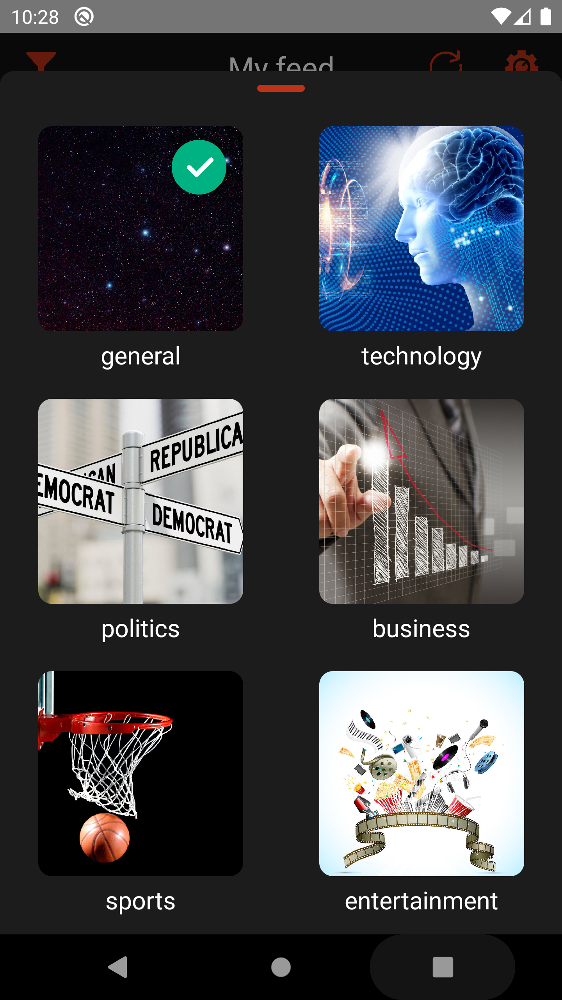

# NewsApp
This is a single-screen react native app. First, you need to signup/login using google account. 
After logging in, you can see images related to the articles &amp; read short descriptions of articles on the page. 
If you want to read the full article, the app navigates you to the article's URL in a webview. 
This app gives you a feel of sliding through articles like reading a newspaper or a book. 
You can also select your favourite news topic from the filters. 

<a href="https://drive.google.com/file/d/1cg3v_4ekbA4TQP2ZcVVrgsHVSolfeqMX/view?usp=sharing">click here</a>
<b> to download apk for android</b>

## API
News info and articles are fetched from an API: http://newsapi.org

### App Preview

<table>
  
  <tr>
    <th>Splash Screen</th>
    <th>Login</th>
    <th>Loading</th>
    <th>Logout</th>
  </tr>
  <tr>
    <td></td>
    <td></td>
    <td></td>
    <td></td>
  </tr>
  
  <tr>
    <th>Feed</th>
    <th>Feed</th>
    <th>Filter</th>
    <th>Filter</th>
  </tr>
  <tr>
    <td></td>
    <td></td>
    <td></td>
    <td></td>
  </tr>
  
</table>
